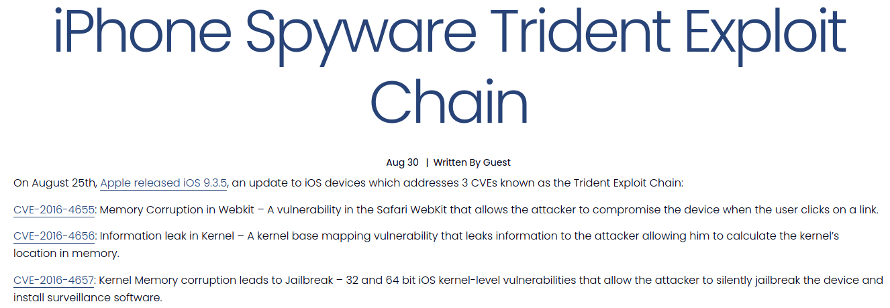
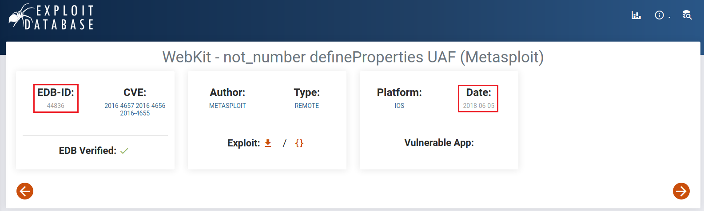

# OSINT - Caught Very Easily (42 solves / 482 points)
**Description :** *It was a strange request from Ahmed Mansoor, he asked us to investigate a lead that promised the "secrets" of the prison he was in. To our surprise it was an attempt to JAILBREAK Mansoor!!*

**Flag format :** *vishwaCTF{EDB-ID_Datewith-}*

### Write-up :
So here, we have an **OSINT challenge** with only a short description to start our reasearch so after reading it carefully, I tried to identify the terms that could be of interest whether directly or with some possible interpretation. From there, we can get the following list :
- Ahmed Mansoor
- Jailbreak
- EDB-ID (from the flag format)

First of all, we'll start with the clue we got from the flag format. You might not know to what *EDB-ID* refers to but with a quick research, you'll find that it's an ID matching an exploit in [Exploit Database](https://www.exploit-db.com/). (I invite you to check out this site if you don't know it already)

So now that we know what we're looking for, let's start to check the clues from the description. You might already know the whole story or have heard about it but anyway, you'll find it quickly once you googled *Ahmed Mansoor* : the **Pegasus Case**. In summary, this worldwide drama refers to a spyware called Pegasus and created by the NSO Group, an Israeli company working with governments agencies. The spyware was able to infiltrate mobile phones giving them access to pretty much everything : location data, photos, passwords, communications etc and the drama occurs in 2016 when it has been made public that NSO used it for spying illegally on journalists, activists and politicians for their clients and and **Ahmed Mansoor** was one of these targets.

Then, you can probably remember we also add a clue about **jailbreaking** which can confirm that we're on the right track with the Pegasus spyware. A few more research later, you'll find Pegasus on three different CVEs called the **Trident Exploit Chain**. Clicking on the first link with such search on Google will give you the three following CVEs :

  

With the exact CVEs, we can easily find the exploit we were looking on the **Exploit Database** giving us the following results with all the information we needed :

  

(You can find also find it by following this link : https://www.exploit-db.com/exploits/44836)

Finally, we got our flag : `vishwaCTF{44836-2018-06-05}`

**Note** : Depending on what terms you looked for, the search engine you used or your location, you could have also go a lot quicker by finding articles giving you all the information you needed directly such as [this one](https://citizenlab.ca/2016/08/million-dollar-dissident-iphone-zero-day-nso-group-uae/) for instance. I list it only now because I wanted to share exactly how I actually solved it and I just stumbled upon this article later, while writing this writeup ^^')
