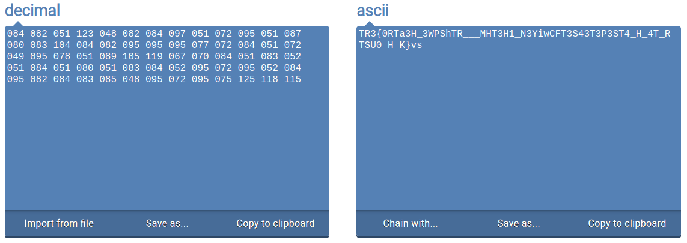
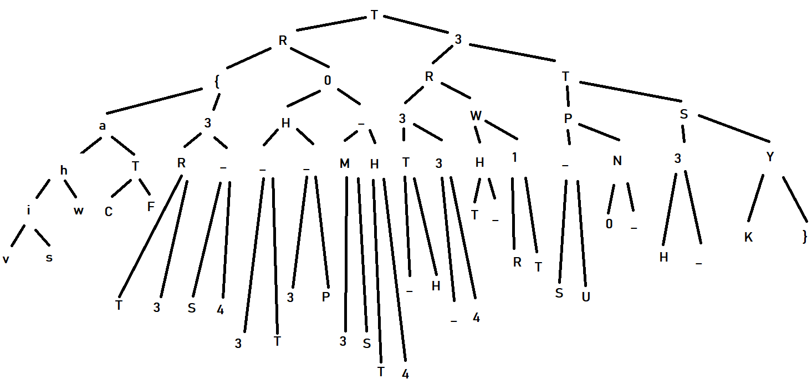
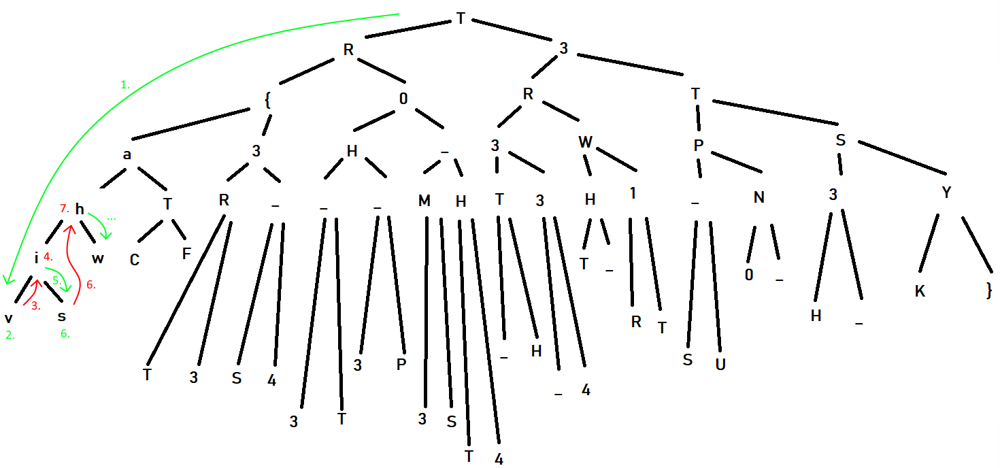

# Misc - Forest Trails (24 solves / 495 points)
**Description :** *In order to survive, we need oxygen, and trees give us oxygen. Also, here's something totally unrelated that you might find interesting.*

  084 082 051 123 048 082 084 097 051 072 095 051 087 
  080 083 104 084 082 095 095 095 077 072 084 051 072 
  049 095 078 051 089 105 119 067 070 084 051 083 052 
  051 084 051 080 051 083 084 052 095 072 095 052 084 
  095 082 084 083 085 048 095 072 095 075 125 118 115

### Write-up :
My first reflex here was to analyze what looks like to be a ciphertext of some kind. I got initially tricked by its structure, the way the numbers were grouped etc and got baited by the theme of the challenge which were obviously related somehow to trees but at the end, I should have identified so much easily the famous character encoding standard known as ASCII... 😅

Next step was to quickly decode it, manually or with one of the numerous tools that can do that. From one of them, I got the following result :

  

From there, it looks like we've the content of the flag but shuffled somehow. After spending quite some time trying to find some logic to reorder it, doing research about actual trees etc I suddenly remembers my distant classes about graph theory and trees. You can read more about graph theory  [here](https://en.wikipedia.org/wiki/Graph_theory) and about the trees we're interested in [here](https://en.wikipedia.org/wiki/Binary_tree).

There are a lot of different types of trees but the ones we're going to focus on here are binary trees. In this type of tree, each node can have at most 2 child nodes referred as *left child* and *right child*. The idea here was to find the right tree and the right way to go through it in order to find our flag. After some assumptions and tests, I got kinda lucky since the first option I went for was the right one. So the goal was to obtain a *rooted complete binary tree* which can be defined as such :
- Rooted : initiates from only one node called root
- Complete : each level of the tree is complete, meaning that each node has the maximum children possible. The only possible exception being the last level that can be not full as long as it gets filled from the left to the right
- Binary tree : each node can have 2 children at most

The resulting trees using our previously found ciphertext looks like this :

  

Now that our tree is ready, we can see that what seems to be the beginning of our flag, the *v*, is at deepest level of three, far left and the rest is around. So we've found the way we want to follow in order to read our tree, the *depth-first search traversal (DFS) in order* technique. (You can find more information about the different options that exist to go through a tree on internet in general or [here](https://towardsdatascience.com/4-types-of-tree-traversal-algorithms-d56328450846) for instance). To summarize very briefly, you start from the root node then :
1. Go as far left as possible by following the left children
2. Read the node
3. Go back to its parent
4. Read the node
5. Go to the right child if any
6. Read the node
7. Go to its closest parent
8. .......

  

Once the full tree read, you got the following flag :
&nbsp;&nbsp;&nbsp;&nbsp;&nbsp;&nbsp;&nbsp;`vishwaCTF{TR33S_4R3_TH3_P03MS_TH4T_TH3_34RTH_WR1T3S_UP0N_TH3_SKY}`

Note : You could also automate this process quite easily but since I wasn't initially sure I was going for the right structure or the right traversal path so doing it manually was a better option to avoid wasting time and honestly, it's fairly quick to do it by hand too 😉
