# OSINT - Money Money Money (12 solves / 499 points)
**Description :** *I have some money hidden for you inside the zip folder. It's all yours but you need to find how I got this money.*

**Hint** (given because of the low number of solves) : *If you have reached the transactions site, maybe try to find a conversation in the correct transaction.*

**Given Files :** *money.zip* and  *richies.jpeg*

### Write-up :
From the description, it seems like our goal lies in the provided zip archive but as we could have expected, it wasn't that easy since it was actually password protected :

  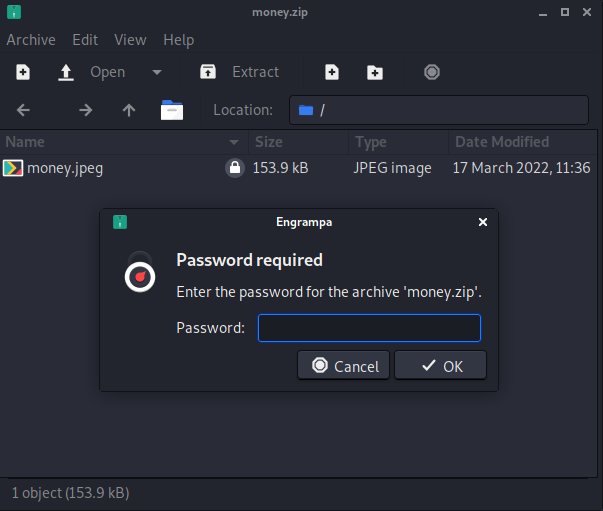

So we do have another image inside this archive but we can't access it for the moment. First reflex in such situation was to try to crack the password using some **dictionnary attack**, I tried for instance to use **john-the-ripper** with the famous **rockyou** wordlist but unfortunately, no result...

  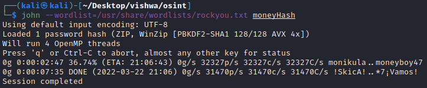

 Now that we checked the zip archive and eliminated the obvious, let's have a look at the second provided file to see what this image has for us. I checked first the content, metadata etc before opening it and found a hidden zip archive inside it.
 

  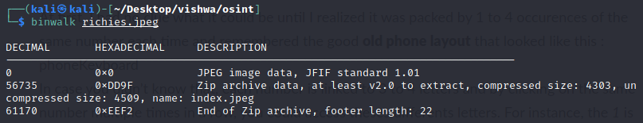

 
 Once this zip extracted, it's **not** password protected this time and it has what looks like a logo inside it :
 

  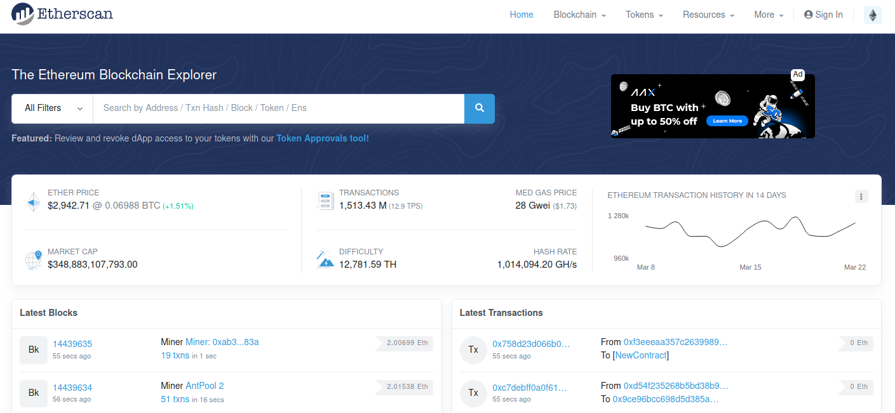

 
 The previous check on this image weren't useful here so the next step was to try to find where it came from, to what it was related. By using some search engine that allows to search by image (Google, Yandex etc), I could find that is in fact the logo of **Etherscan** which basically allows you to explore the Ethereum blockchain. The new question being : what are we going to look for here ??

Maybe it's time to open the image that we've been given to see what is in it. Once opened, we obtain the following code :

  

 
 At first, I had no clue what it could be until I realized it was packed by 1 to 4 occurences of the same number each time and remembered the good **old phone layout** that looked like this :

  

 
In case you didn't know that, each number is linked to 3 to 4 letters and by clicking on the same number multiple times in a row, you could access theses differents letters. For instance, the *1* is linked to *a*, *b* and *c* ; click once for the *a*, twice for the *b* etc. You can quickly decode manually or by using some online tool. Anyway, you'll obtain the following plaintext :
 
IN THE LAST YEAR I INVESTED IN HUNDRED DOGECOIN GOLD AND GOT HUGE PROFITS HAVE A LOOK AT SOME OF MY TRANSACTIONS IF YOU ARE STUCK YOU HAVE EVERYTHING YOU NEED LOOK CLOSELY

So, we got some useful information here : we'll be focusing on the Dogecoin Gold looking for some transactions done last year for a hundred Dogecoins Gold. Let's also keep in mind the hint that were given initially telling us to try to find a conversation linked to some transaction.

Going back to Etherscan, let's select the right token :

  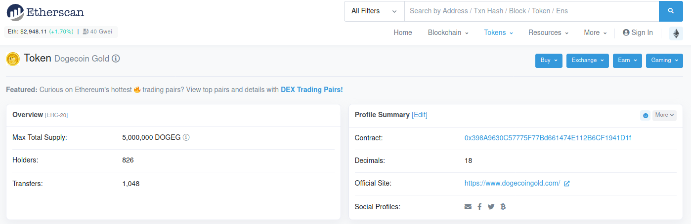

As you can see below, out of 1048 transactions found, there were only 5 transactions done during the last year and only three of them for an amount of 100 DOGEG.

  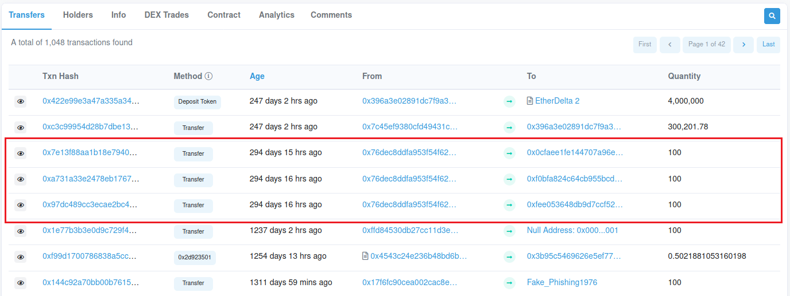

Opening each of them, we can see there is a comment section that could contain the *conversation* we're looking for and as expected, we can see in that in one of them :

  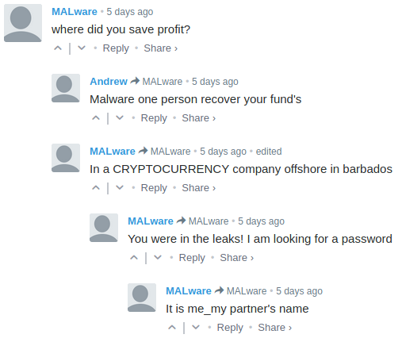

There are two importants things we can extract from this conversation :
1. The password of our initial zip archive looks like this : `<One (first or last) Name>_<Another (first or last) Name>`
2. Some leaks and an offshore company in Barbados are mentionned

The second point might be the start to find the identities of the two people we're looking for so we can unlock our archive. After doing some research, I found a very interesting site from the **International Consortium of Investigative Journalists (ICIJ)** called [Offshore Leaks](https://offshoreleaks.icij.org/) which is a database gathering all the *"offshore companies, foundations and trusts from the Pandora Papers, Paradise Papers, Bahamas Leaks, Panama Papers and Offshore Leaks investigations"*. (If you don't know about that, feel free to read more about these scandals even though it's not relevant for this challenge)

  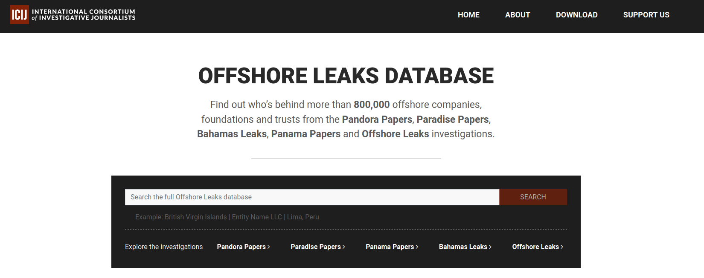

After doing some research on this database, I couldn't find anything that seemed correct because I narrowed down my research a bit too much at the beginning and then I remembered one thing from the conversation, a word that was surprisingly in uppercase, you had probably noticed it already... Using this to specify our research, we found only one offshore company whose name contains *Cryptocurrency* and it's located in the Barbados !

  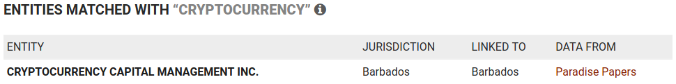

Let's click on it to see what it has for us, maybe finally some names... And here they are, this company is owned by two people called *Gabriel Esper ABED* and *Oliver Louis GALE* :

  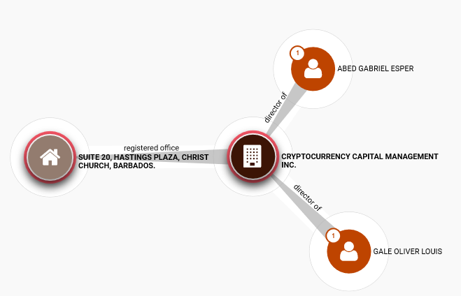

So now the good new is that we found the password for our zip. After various combinations tried (uppercase/lowercase, first name/last name), the password is `LOUIS_ESPER`. Once the zip archive unlocked, we could extract the following image without a directly visible flag...

  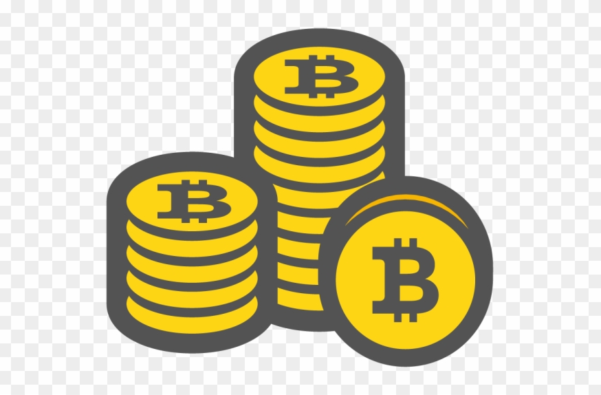

...But ! After trying some basic stego techniques/tools, I discovered that **steghide**, a stego tool supporting JPEG, BMP, WAV and AU files, had been used to hide data inside this image with an empty password. I used **stegseek** which is the fastest steghide cracker to discover that and recover the hidden data :

  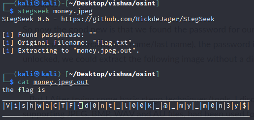

**Flag :** `VishwaCTF{d0nt_l00k_@_my_m0n3y$}`
